# Hotelio Monolith — Юзкейсы и стратегия миграции Strangler Fig

## Диаграмма юзкейсов

```mermaid
graph TB
    subgraph "Hotelio Monolith"
        subgraph "Booking Service"
            UC1[Создать бронирование]
            UC2[Список бронирований]
        end
        
        subgraph "User Service"
            UC3[Получить информацию о пользователе]
            UC4[Проверить статус пользователя]
            UC5[Проверить чёрный список]
            UC6[Проверить активность]
            UC7[Проверить авторизацию]
            UC8[Проверить VIP-статус]
        end
        
        subgraph "Hotel Service"
            UC9[Получить информацию об отеле]
            UC10[Проверить работоспособность отеля]
            UC11[Проверить полную занятость]
            UC12[Найти отели в городе]
            UC13[Найти топ отелей]
        end
        
        subgraph "Promo Code Service"
            UC14[Получить промокод]
            UC15[Проверить валидность промокода]
            UC16[Валидировать промокод для пользователя]
        end
        
        subgraph "Review Service"
            UC17[Получить отзывы об отеле]
            UC18[Проверить доверенность отеля]
        end
    end
    
    Guest((Гость))
    Admin((Админ))
    
    Guest --> UC1
    Guest --> UC2
    Guest --> UC9
    Guest --> UC12
    Guest --> UC13
    Guest --> UC17
    
    Admin --> UC3
    Admin --> UC4
    Admin --> UC5
    Admin --> UC6
    Admin --> UC7
    Admin --> UC8
    Admin --> UC10
    Admin --> UC11
    Admin --> UC14
    Admin --> UC15
    Admin --> UC16
    Admin --> UC18
```



## Описания юзкейсов

### 1. Управление бронированиями

#### UC1: Создать бронирование
**Актор:** Гость  
**Эндпоинт:** `POST /api/bookings?userId={id}&hotelId={id}&promoCode={code}`  
**Описание:** Гость создаёт новое бронирование отеля с опциональным промокодом

**Основной сценарий:**
1. Гость отправляет запрос на бронирование с userId, hotelId и опциональным promoCode
2. Система валидирует пользователя: проверяет активность и отсутствие в чёрном списке
3. Система валидирует отель: проверяет работоспособность, доверенность и отсутствие полной занятости
4. Система определяет базовую цену: VIP-пользователи платят 80.0, остальные — 100.0
5. Система валидирует и применяет скидку по промокоду (если указан)
6. Система рассчитывает финальную цену: `finalPrice = basePrice - discount`
7. Система сохраняет бронирование с userId, hotelId, promoCode, discountPercent, price, createdAt
8. Система возвращает детали созданного бронирования

**Альтернативные сценарии:**
- 2a. Пользователь неактивен или в чёрном списке → Отказ с ошибкой
- 3a. Отель нерабочий, недоверенный или полностью занят → Отказ с ошибкой
- 5a. Промокод невалиден или истёк → Отказ с ошибкой

**Зависимости:** UserService, HotelService, ReviewService, PromoCodeService

---

#### UC2: Список бронирований
**Актор:** Гость, Админ  
**Эндпоинт:** `GET /api/bookings?userId={id}`  
**Описание:** Получить все бронирования или отфильтровать по пользователю

**Основной сценарий:**
1. Пользователь запрашивает список бронирований (опционально фильтруя по userId)
2. Система возвращает список всех подходящих бронирований с деталями

---

### 2. Управление пользователями

#### UC3: Получить информацию о пользователе
**Актор:** Админ  
**Эндпоинт:** `GET /api/users/{userId}`  
**Описание:** Получить полный объект пользователя со статусом, флагами чёрного списка и активности

---

#### UC4: Проверить статус пользователя
**Актор:** Админ  
**Эндпоинт:** `GET /api/users/{userId}/status`  
**Описание:** Получить строку статуса пользователя (например, "ACTIVE", "VIP")

---

#### UC5: Проверить чёрный список
**Актор:** Админ  
**Эндпоинт:** `GET /api/users/{userId}/blacklisted`  
**Описание:** Проверить, находится ли пользователь в чёрном списке

---

#### UC6: Проверить активность
**Актор:** Админ  
**Эндпоинт:** `GET /api/users/{userId}/active`  
**Описание:** Проверить, активен ли аккаунт пользователя

---

#### UC7: Проверить авторизацию
**Актор:** Админ  
**Эндпоинт:** `GET /api/users/{userId}/authorized`  
**Описание:** Проверить, авторизован ли пользователь (активен И не в чёрном списке)

---

#### UC8: Проверить VIP-статус
**Актор:** Админ  
**Эндпоинт:** `GET /api/users/{userId}/vip`  
**Описание:** Проверить, является ли пользователь VIP (eligible для специальных цен и промокодов)

---

### 3. Управление отелями

#### UC9: Получить информацию об отеле
**Актор:** Гость, Админ  
**Эндпоинт:** `GET /api/hotels/{id}`  
**Описание:** Получить детальную информацию об отеле

---

#### UC10: Проверить работоспособность отеля
**Актор:** Админ  
**Эндпоинт:** `GET /api/hotels/{id}/operational`  
**Описание:** Проверить, работает ли отель

---

#### UC11: Проверить полную занятость
**Актор:** Админ  
**Эндпоинт:** `GET /api/hotels/{id}/fully-booked`  
**Описание:** Проверить, полностью ли забронирован отель

---

#### UC12: Найти отели в городе
**Актор:** Гость  
**Эндпоинт:** `GET /api/hotels/by-city?city={city}`  
**Описание:** Поиск отелей в конкретном городе

---

#### UC13: Найти топ отелей
**Актор:** Гость  
**Эндпоинт:** `GET /api/hotels/top-rated?city={city}&limit={n}`  
**Описание:** Получить топ отелей в городе, отсортированных по рейтингу

---

### 4. Управление промокодами

#### UC14: Получить промокод
**Актор:** Админ  
**Эндпоинт:** `GET /api/promos/{code}`  
**Описание:** Получить детали промокода

---

#### UC15: Проверить валидность промокода
**Актор:** Админ  
**Эндпоинт:** `GET /api/promos/{code}/valid?isVipUser={bool}`  
**Описание:** Проверить, валиден ли промокод (не истёк и проверка VIP-ограничения)

---

#### UC16: Валидировать промокод для пользователя
**Актор:** Админ  
**Эндпоинт:** `POST /api/promos/validate?code={code}&userId={id}`  
**Описание:** Валидировать промокод для конкретного пользователя (автоматически определяет VIP-статус)

---

### 5. Управление отзывами

#### UC17: Получить отзывы об отеле
**Актор:** Гость  
**Эндпоинт:** `GET /api/reviews/hotel/{hotelId}`  
**Описание:** Получить все отзывы для конкретного отеля

---

#### UC18: Проверить доверенность отеля
**Актор:** Админ  
**Эндпоинт:** `GET /api/reviews/hotel/{hotelId}/trusted`  
**Описание:** Проверить, заслуживает ли отель доверия (средний рейтинг >= 4.0 И количество отзывов >= 10)

---

## Граф зависимостей сервисов

```
┌─────────────────┐
│ BookingController│
└────────┬─────────┘
         │
         ▼
┌─────────────────┐
│ BookingService  │  ◄── НАИБОЛЬШАЯ НАГРУЗКА / ОРКЕСТРАТОР
└────┬─────┬──┬───┘
     │     │  │  │
     │     │  │  └──────────┐
     │     │  │             ▼
     │     │  │      ┌──────────────┐
     │     │  │      │PromoCodeSvc  │
     │     │  │      └──────┬───────┘
     │     │  │             │
     │     │  └─────────────┼──────┐
     │     │                │      ▼
     │     │         ┌──────────────┐
     │     └────────>│ReviewService │
     │               └──────────────┘
     │
     │               ┌──────────────┐
     └──────────────>│  HotelSvc    │
                     └──────────────┘
                     
                     ┌──────────────┐
                     │ AppUserSvc   │
                     └──────────────┘
                     (используется Booking, PromoCode)
```

---

## Почему начинаем с BookingService: Обоснование Strangler Fig

### Решение: Выделить BookingService первым

Мы начинаем миграцию по паттерну Strangler Fig с выделения **BookingService** как первого независимого микросервиса.

### Причины

#### 1. **Наиболее нагруженный компонент**
BookingService — самый нагруженный компонент в монолите. Каждое создание бронирования запускает сложную цепочку валидаций, вызывая 4 других сервиса:
- `AppUserService` (валидация пользователя)
- `HotelService` (валидация отеля)
- `ReviewService` (проверка доверенности)
- `PromoCodeService` (расчёт скидки)

В пиковые периоды эта оркестрация становится главным bottleneck. Выделив его первым, мы можем независимо масштабировать критический путь, не масштабируя весь монолит.

#### 2. **Чёткий ограниченный контекст (Bounded Context)**
BookingService имеет чёткие границы:
- **Вход:** `POST /api/bookings` (создание), `GET /api/bookings` (список)
- **Выход:** Записи бронирований с рассчитанными ценами и скидками
- **Ответственность:** Оркестрация валидаций, расчёт цен, сохранение бронирований

Это идеальный кандидат для выделения — у него чёткие контракты входа/выхода и собственная доменная модель.

#### 3. **Максимальная бизнес-ценность**
Процесс бронирования — основная функция платформы, генерирующая доход. Любое улучшение производительности или надёжности напрямую влияет:
- Пользовательский опыт (быстрее подтверждение бронирования)
- Надёжность системы (изолированные ошибки не каскадируются)
- Операционные затраты (точечное масштабирование вместо масштабирования всего монолита)

#### 4. **Зависимости только на чтение**
BookingService **зависит от** других сервисов, но не владеет их данными. Он:
- Читает статус пользователя (активен, в чёрном списке, VIP)
- Читает информацию об отеле (работоспособен, полностью занят)
- Читает агрегаты отзывов (статус доверенности)
- Читает валидность промокода

Такой паттерн зависимостей только на чтение делает выделение безопаснее — нам не нужно сразу мигрировать общие данные. Выделенный BookingService может вызывать монолит обратно через HTTP/gRPC для валидаций в период перехода.

#### 5. **Выявленные узкие места производительности**
Текущая реализация имеет известные проблемы производительности в потоке бронирования:
- `ReviewService.isTrustedHotel()` загружает ВСЕ отзывы в память (операция O(N))
- Отсутствует кэширование — каждое бронирование обращается к базе для всех валидаций
- Захардкоженные базовые цены (80.0/100.0) вместо динамического ценообразования

Выделение BookingService позволяет:
- Оптимизировать проверку доверенности через правильную SQL-агрегацию
- Внедрить кэширование результатов валидаций
- Реализовать логику динамического ценообразования независимо

#### 6. **Соответствие паттерну Strangler Fig**
Паттерн Strangler Fig лучше всего работает, когда выделяется **вертикальный срез**, который:
- Имеет чёткие точки входа/выхода ✓ (REST-эндпоинты)
- Является частой точкой боли ✓ (bottleneck пиковой нагрузки)
- Может быть постепенно мигрирован ✓ (зависимости только на чтение)
- Даёт немедленный ROI ✓ (масштабирование, надёжность)

BookingService удовлетворяет всем критериям.

#### 7. **Независимость команд**
После выделения команда бронирований сможет:
- Деплоить независимо от монолита
- Выбирать оптимальный технологический стек (кэширование, оптимизация запросов к БД)
- Масштабироваться горизонтально в пиковые сезоны без масштабирования других компонентов
- Итерировать быстрее над фичами бронирования без рисков деплоя монолита

#### 8. **Фундамент для будущих выделений**
Выделение BookingService первым создаёт паттерн миграции, инструментарий и инфраструктуру, которые будут переиспользованы для последующих выделений:
- Конфигурация API Gateway / маршрутизации
- Межсервисная коммуникация (gRPC, как в task2)
- Пайплайны деплоя (Kubernetes, как в task4)
- Настройка наблюдаемости и мониторинга

### Подход к миграции

1. **Фаза 1 (текущая):** BookingService как отдельный сервис с gRPC-интерфейсом (task2)
2. **Фаза 2:** Реализация API Gateway для маршрутизации запросов бронирования на новый сервис
3. **Фаза 3:** Постепенное перенаправление трафика с монолита на BookingService
4. **Фаза 4:** Удаление логики бронирования из монолита после стабилизации нового сервиса
5. **Фаза 5:** Повторение процесса для следующего сервиса с высокой ценностью (например, HotelService)

### Снижение рисков

| Риск | Митигация |
|------|-----------|
| Консистентность данных | Использовать Saga паттерн или eventual consistency в период перехода |
| Регрессия производительности | Провести всестороннее нагрузочное тестирование перед переключением трафика |
| Полнота функциональности | Использовать strangler-паттерн — новый сервис должен обрабатывать 100% существующих юзкейсов |
| Возможность отката | Сохранить логику бронирования в монолите до доказательства стабильности нового сервиса |

---

## Итог

BookingService — оптимальный первый кандидат для выделения по Strangler Fig, потому что он:
- Обрабатывает наибольшую нагрузку и является главным bottleneck производительности
- Имеет чёткий ограниченный контекст с хорошо определёнными API
- Напрямую влияет на бизнес-доход и пользовательский опыт
- Имеет зависимости только на чтение, что делает выделение безопаснее
- Создаёт переиспользуемые паттерны для будущих выделений сервисов
- Позволяет независимое масштабирование, деплой и автономию команд
